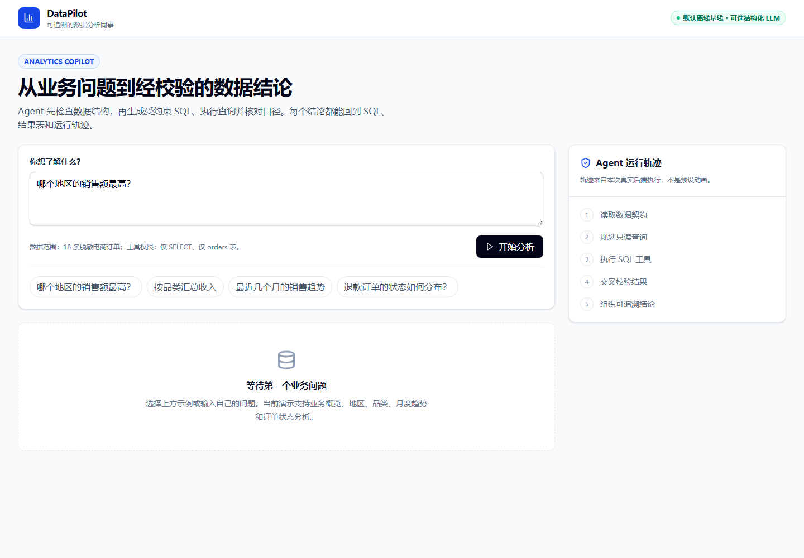

# DataPilot：可追溯数据分析 Agent

DataPilot 是一个面向业务同事的数据分析 Agent。用户提出自然语言问题后，工作流会检查数据契约、选择分析意图、生成受约束 SQL、调用 SQLite 工具、交叉校验汇总口径，并返回结论、图表、表格和完整轨迹。

默认运行在 `deterministic-demo` 模式，不需要 API Key。配置阿里云百炼千问的 OpenAI-compatible 端点后，模型只负责在允许列表中选择分析意图；SQL 仍来自审查模板并经过工具层校验。这样既能演示真实模型调用，也保留可复现基线。



## 能证明什么

- 用 LangGraph 实现显式的五步 Agent 状态流，而不是单轮聊天接口。
- SQL 工具只允许 `SELECT` 且只能访问 `orders` 表；写操作、多语句和其他表会被拒绝。
- 支持结构化 LLM 路由、输出白名单校验与失败回退，并记录模型调用/回退次数。
- 分组分析会用独立总量查询做一致性校验，最终结论保留 SQL 与执行证据。
- 前后端类型契约、FastAPI 接口、pytest 测试、离线评测和 Docker 运行方式齐全。

## 架构

```text
React 工作台
    │ POST /api/analyze
    ▼
FastAPI ──► LangGraph
             1. inspect_schema
             2. plan_query
             3. execute_query ──► 只读 SQLite 工具
             4. verify_result ──► 独立口径检查
             5. compose_answer
    │
    └──► 结论 + SQL + 表格 + 图表 + trace + metrics
```

更详细的边界和决策见 [`docs/architecture.md`](docs/architecture.md)。

## 本地启动

要求：Python 3.11+、Node.js 20+、pnpm 或 npm。

后端（PowerShell）：

```powershell
cd E:\简历\Project1-2-3\01-datapilot
uv venv .venv --python 3.12
uv pip install --python .venv\Scripts\python.exe -e ".[dev]"
.venv\Scripts\python.exe -m uvicorn app.main:app --app-dir backend --port 8001
```

前端（另开一个 PowerShell）：

```powershell
cd E:\简历\Project1-2-3\01-datapilot\frontend
pnpm install
pnpm dev
```

浏览器访问 `http://localhost:5173`，接口文档位于 `http://localhost:8001/docs`。

可选千问模式：将 `.env.example` 中的 `AGENT_LLM_BASE_URL`、`AGENT_LLM_API_KEY` 和 `AGENT_LLM_MODEL` 注入当前 PowerShell 或 Railway 服务环境；默认示例使用百炼兼容端点和 `qwen-plus`。不要提交真实 Key。若变量不完整，服务会明确回到离线基线。若 Key 属于特定地域或业务空间，请以百炼控制台提供的兼容模式地址为准。

## 公开演示防护

公开入口默认启用服务端防护：单 IP 20 次/60 秒、进程级全局 5 QPS、单会话 12 轮、单实例每日 100 次调用、单次输入最多 500 字符（安全层可调至 2000）、模型输出最多 400 tokens。输入会过滤控制字符并拦截常见的提示注入指令；模型只通过后端代理调用，浏览器不会接触 API Key。限流、输入拒绝或模型故障时，接口返回稳定的非 5xx 限制/错误结构，前端自动切换到与内置订单数据一致的预录制结果。

所有上限都可用 `.env.example` 中的变量调整，但计数是单进程内存状态：重启会清零，多副本不会共享，不能抵御分布式滥用。`TRUST_PROXY_HEADERS` 只有在确认部署平台代理链可信后才应设为 `true`。这些措施不能替代模型厂商控制台的消费上限、账单告警和密钥轮换。

也可以在项目根目录运行同源容器（前端由 FastAPI 一并托管）：

```powershell
docker compose up --build
```

浏览器访问 `http://localhost:8001`；容器内部会读取 Railway/Compose 注入的 `PORT`，并将运行状态写入 `/app/runtime`。需要持久化 SQLite 运行状态时，将该目录挂载为 Railway Volume。

## 测试与评测

```powershell
.venv\Scripts\python.exe -m pytest
.venv\Scripts\python.exe -m ruff check backend tests evals
.venv\Scripts\python.exe evals\run_eval.py
pnpm --dir frontend build
```

评测集位于 `evals/cases.json`，报告由真实运行写入 `evals/report.json`。当前代码不会预填效果数字。

## 支持的问题

- 业务概览
- 按地区汇总销售额
- 按品类汇总销售额
- 月度销售趋势
- 订单/退款状态分布

超出这些意图时会回落到业务概览。这是当前演示版明确的能力边界，不声称支持任意数据库问答。

## 目录

```text
backend/app/       API、LangGraph 工作流、SQLite 工具
data/orders.csv    可公开演示的小型订单数据
frontend/          React + TypeScript 工作台
tests/             API、工作流和 SQL 安全边界测试
evals/             路由/执行/校验评测集与脚本
docs/              架构决策
```

## 已知限制

- 模型只做受约束路由，不直接生成 SQL；当前不宣称理解任意 Schema。
- 数据是人工构造的脱敏样例，不能用于推断真实业务表现。
- `recent_runs` 是进程内缓存；生产版本应持久化并增加身份认证与租户隔离。
